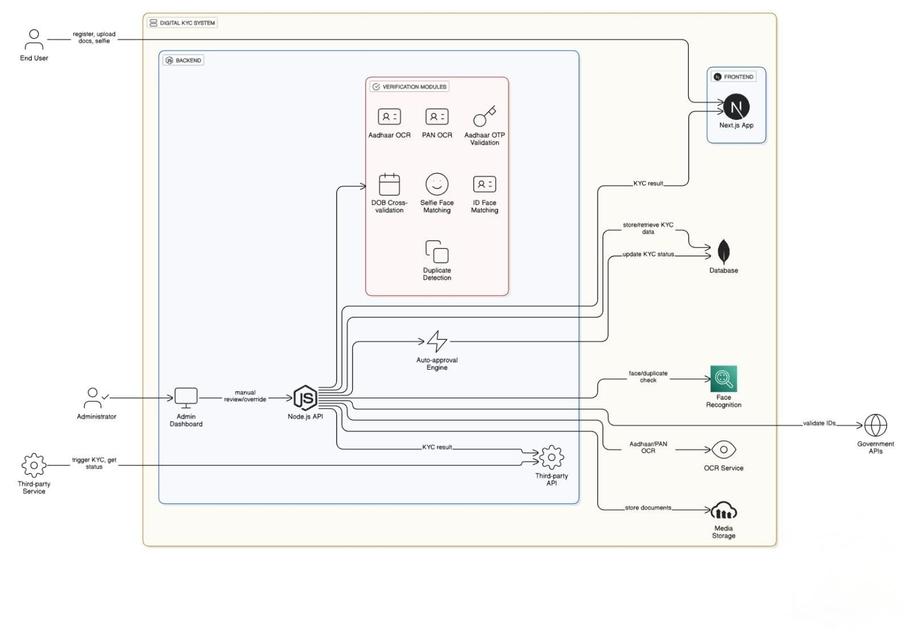

# 🚀 Digital KYC System  
Automated Aadhaar & PAN OCR + Face Recognition + Admin Verification Dashboard

---

## 🧾 **Overview**

The **Digital KYC System** is a full-stack solution enabling automated identity verification using:

- Aadhaar OCR  
- PAN OCR  
- DOB cross-validation  
- Selfie + ID face matching  
- Duplicate detection  
- Auto-approval engine  
- Full admin dashboard for manual approval  

Built using **Next.js + Node.js + MongoDB + Cloudinary + Tesseract + AWS Rekognition**.

---

## 🏛 System Architecture

---

## ✨ Features

### 👤 **User Features**
- Create user  
- Aadhaar upload → OCR → auto-extract fields  
- PAN upload → OCR → extract fields  
- DOB cross-match between Aadhaar & PAN  
- Selfie upload → face match (AWS Rekognition)  
- Automatic duplicate detection  
- Automatic approval logic  

### 🛡 **Admin Features**
- Admin login (JWT Auth)  
- Dashboard with search, filter, pagination  
- View full KYC details  
- Approve or Reject KYC  
- Reject with reason  
- Track attempts, stages, statuses  

---

## 🎯 Tech Stack

| Layer | Technology |
|-------|------------|
| Frontend | Next.js, React, Tailwind CSS |
| Backend | Node.js, Express.js |
| Database | MongoDB (Mongoose) |
| OCR | Tesseract.js |
| Face Match | AWS Rekognition |
| File Storage | Cloudinary |
| Auth | JWT |

---

---

## 🔌 API Endpoints

### 👤 **User APIs**
| Method | Endpoint | Description |
|--------|----------|-------------|
| POST | `/api/create-user` | Register user |
| POST | `/api/upload-aadhaar` | Upload Aadhaar |
| POST | `/api/ocr-aadhaar` | Extract Aadhaar details |
| POST | `/api/upload-pan` | Upload PAN |
| POST | `/api/ocr-pan` | Extract PAN details |
| POST | `/api/face-match` | Selfie face match |
| POST | `/api/auto-approve` | Auto-approval engine |

### 🛡 **Admin APIs**
| Method | Endpoint | Description |
|--------|----------|-------------|
| POST | `/api/admin/login` | Admin login |
| GET | `/api/admin/kycs` | All KYCs |
| GET | `/api/admin/kycs/:id` | Single KYC details |
| POST | `/api/admin/kycs/:id/approve` | Approve KYC |
| POST | `/api/admin/kycs/:id/reject` | Reject KYC |

---

NEXT_PUBLIC_API_URL=http://localhost:8000

cd backend
npm install
npm start

cd frontend
npm install
npm run dev

## 📊 Performance Results

| Feature | Result |
|--------|--------|
| ⚡ Verification Speed | 70% faster |
| 🔍 OCR Accuracy | ~85% |
| 🙂 Face Match Threshold | 60% optimized |
| 🧑‍💼 Manual Dependency | Eliminated |
| 📈 Scalability | Fintech, Banks, NBFCs, Education, Logistics |

---

## 🚀 Future Enhancements

- 🔗 DigiLocker API Integration
- 👁️ Liveliness Detection
- 🎥 Video KYC
- 🤖 AI Fraud Scoring
- 🌏 Multi-Language OCR
- 📊 Real-Time KYC Scoring System

---

## 🏁 Conclusion

The **Digital KYC System** delivers a complete, secure, and automated approach to customer verification using cutting-edge technologies like OCR, face recognition, and admin approval workflows.  
It significantly improves speed, accuracy, and operational scalability.

👨‍💻 Author

Bimal Sharma
Full-Stack Developer

📜 License

This project is released under the MIT License.